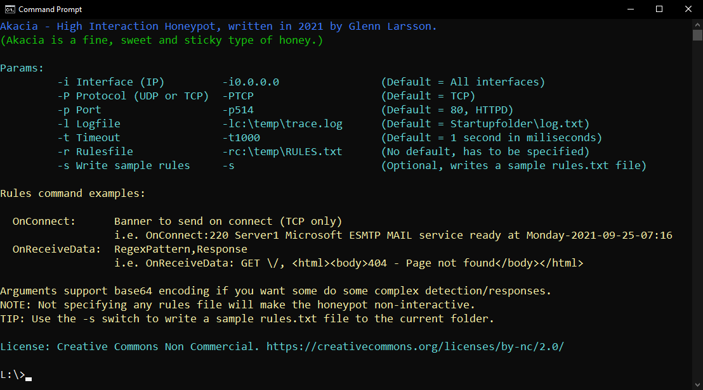
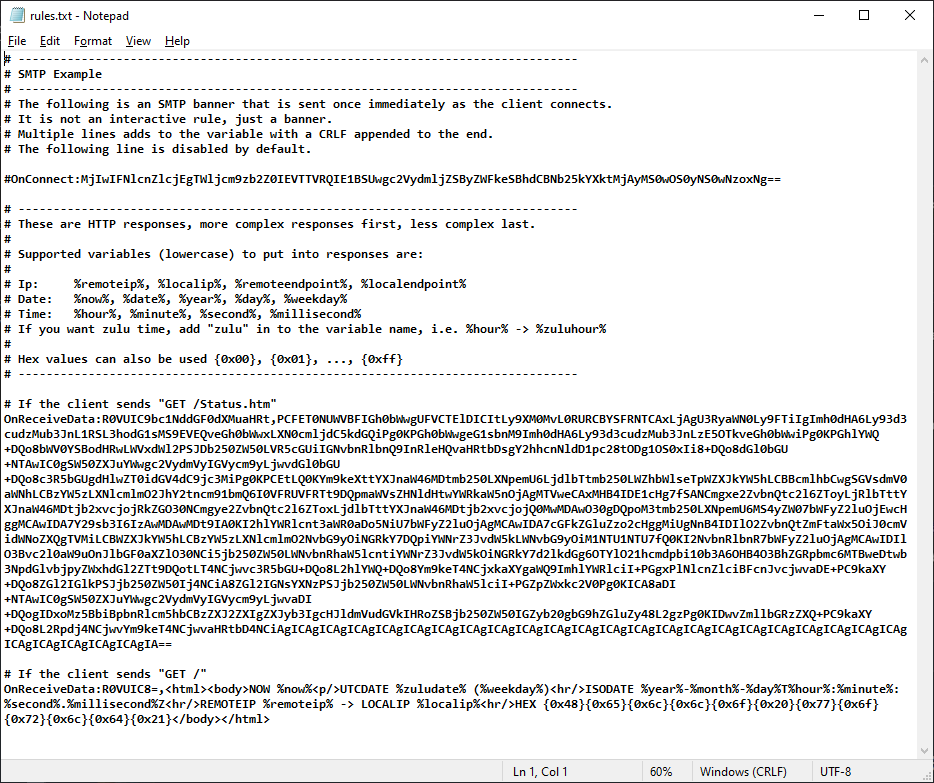
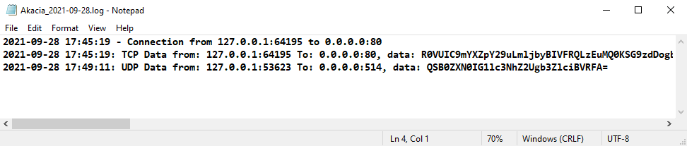
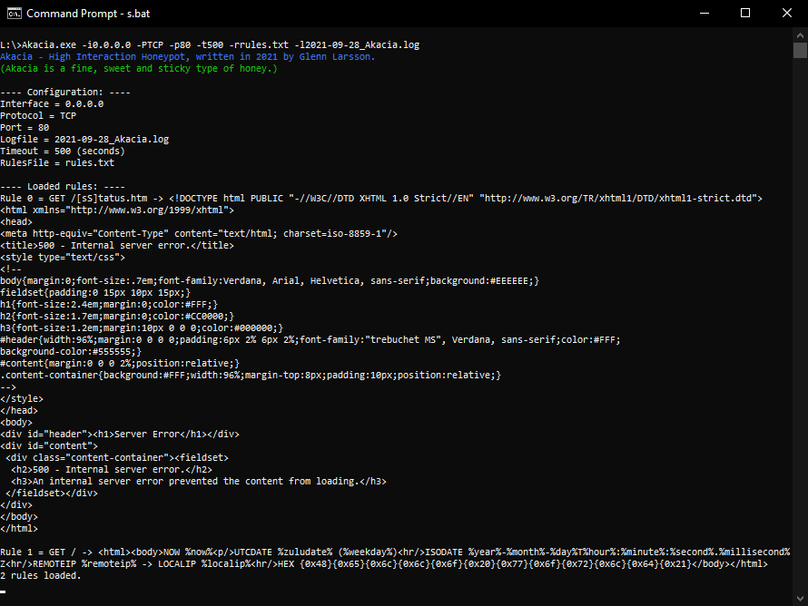

# Akacia - High Interaction Honeypot.

Akacia is a high quality honey that is tasty and very sticky. It is made from the flower Robinia, which is called "False Akacia", which is a pretty good name for a Honeypot.

Akacia can simulate TCP and UDP services, it supports rules that return data on interaction. Rules are RegEx based and both the responses and rules can be Base64 encoded so that complex structures, like HTML which is multiline can be delivered back to the client.

## Rules

There are two types of rules:

**OnConnect:string**

OnConnect is sent as soon as the client connects. Needless to say, this is only supported for TCP as UDP is stateless and does not connect, as it just sends data regardless if anyone on the other side is listening or not.

**OnReceiveData:pattern,response**

OnReceiveData matches patterns (strings or regex) in the received data and if there is a match it sends the response.

Only some basic rule examples are provided as i don't have the time to write rules for every network service out there. Run **Akacia.exe -s** and it will write an example rules.txt file to the current folder. Read that for more info.

## Variables

There are also some variables that can be used in responses to make the honeypot look more alive and not as static:

- %now% and %date% returns a basic timestamp using whatever system format is configured
- %zulunow% and %zuludate% returns the same, but with UTC time.
- %year% returns a 4 digit year
- %month% returns a 2 digit month
- %day% returns a 2 digit day
- %hour% returns a 2 digit hour
- %minute% returns a 2 digit minute
- %second% returns a 2 digit second
- %millisecond% returns a 3 digit millisecond

There is also UTC variants, the following are supported:
- %zuluyear%, %zulumonth%, %zuluday%, %zuluhour%, %zuluminute%, %zulusecond%

- %weekday% returns a litteral string, i.e. "Monday"
- %zuluweekday% returns a UTC based litteral string

- %remoteendpoint% returns the remote endpoint, i.e. 1.2.3.4:80
- %remoteip% returns the remote ip adress, i.e. 1.2.3.4
- %localendpoint% and %localip% do the same, but for the local endpoint/ip

Aaaand hex values can also be used {0x00}, {0x01}, ..., {0xff}

## Multiple Instances

You can start multiple instances of Akacia with different configs, using different ports an protocols:

Simulate a Webserver: 
**C:\\> start Akacia.exe -i0.0.0.0 -PTCP -p80 -t500 -rwebserver-rules.txt -lAkacia_Web_%date%.log**

Simulate a Syslog server: 
**C:\\> start Akacia.exe -i0.0.0.0 -PUDP -p514 -t500 -rsyslog-rules.txt -lAkacia_Syslog_%date%.log**

Note: If you provide no rules file, it will basically be a dumb low interaction honeypot.

## Logging

All logging uses Append mode, logfiles are not locked (which is a stupid practice), so if you want to parse the logfiles, just move it somewhere and parse it, new entries will be created in a new logfile with the same name.

## Limitations
- For now only an executable will be released. I'll make a decision about the source code at a later point.
- Logfiles will have to be gathered manually, if you want automatic forwarding, that is for you to build.
- No TLS support.
- Single threaded, Single socket.

## License
**Creative Commons - Non commercial**.

Basically like CCZero, but you are not allowed to profit from this, like being an MSSP. The password for the zip file is "CC-NC" (capital letters). If you want to throw up some Honeypots on your corporate network to detect scanning and probing, i'm fine with that. I just don't want security companies to use this for free and make money on it.

Read more here: [https://creativecommons.org/licenses/by-nc/2.0/](https://creativecommons.org/licenses/by-nc/2.0/)

## Installation:
1. Unzip file (password is explained in the License section above).
2. If you haven't got .NET runtine 4.7.2. installed, get that now.
3. Done. Everything is included in the standalone executable.

Thats it.
Feedback, Requests and Bug reports are welcome: [https://twitter.com/pro_integritate](https://twitter.com/pro_integritate)
